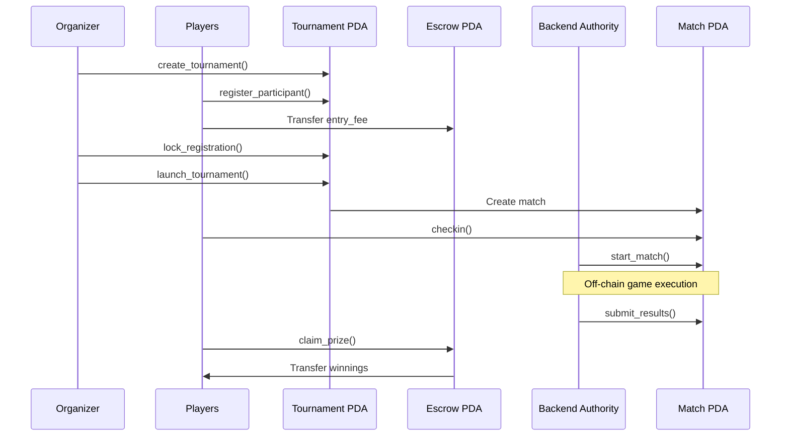
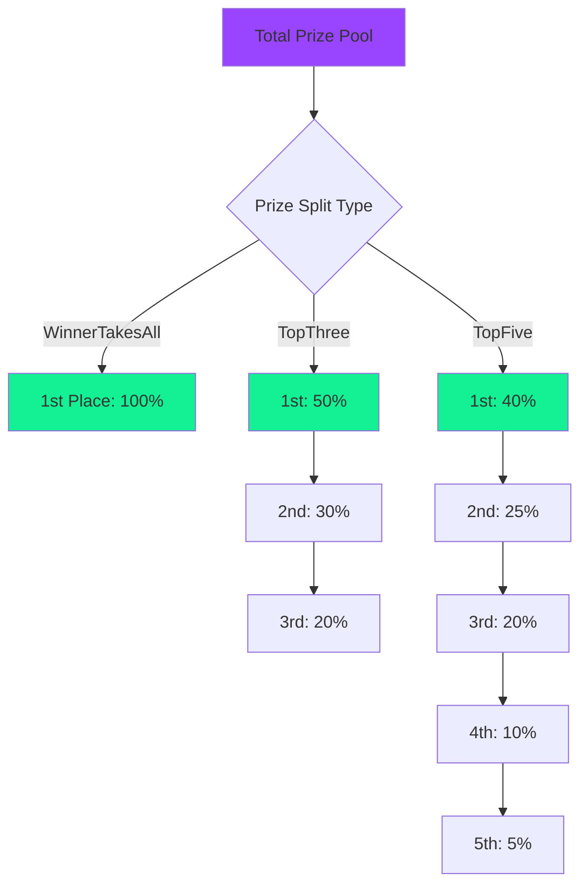

<div align="center">

# 🏆 TARNI

### Tournament Platform on Solana

*Gaming Tournaments with Automated Results*

[](https://explorer.solana.com/address/6ZDRzAxyRYS5GsZKEm4BWjEty3NaBuvRg8GvzDKck27c?cluster=devnet)
[](https://www.anchor-lang.com/)
[](https://www.rust-lang.org/)
[](./tests/)

**Program ID:** `6ZDRzAxyRYS5GsZKEm4BWjEty3NaBuvRg8GvzDKck27c`

</div>

---

## 🎯 Overview

Tarni is a tournament management system built on Solana using the Anchor framework. It enables trustless, transparent gaming tournaments with automated results and prize distribution.

**Core Features:**

- Tournament creation and management
- Automated escrow system for entry fees and prizes  
- Real-time state management 
- Automated Results
- verifiable match results
- Complete on-chain audit trail
---

## 🏗️ **System Architecture**


### **Prize Distribution Models**



***

## 💾 Core Account Structures

### Tournament Account

```rust
pub struct Tournament {
    pub tournament_id: u64,           // Unique identifier
    pub organizer: Pubkey,            // Authority for tournament ops
    pub backend: Pubkey,              // Authority for match ops
    pub game_type: GameType,          // Currently: SingleMatch
    pub entry_fee: u64,               // SOL lamports
    pub max_participants: u8,         // Max players allowed
    pub current_participants: u8,     // Current registered count
    pub prize_split: PrizeSplit,      // Distribution model
    pub rules: String,                // Tournament rules (max 200 chars)
    pub state: TournamentState,       // Current lifecycle state
    pub created_at: i64,              // Creation timestamp
    pub starts_at: i64,               // Tournament start time
    pub checkin_opens: i64,           // Check-in window start
    pub checkin_closes: i64,          // Check-in deadline
    pub started_at: i64,              // Actual start timestamp
    pub escrow: Pubkey,               // Escrow PDA holding funds
    pub prize_pool: u64,              // Total prize amount
    pub escrow_bump: u8,              // Escrow PDA bump
    pub bump: u8,                     // Tournament PDA bump
}
```

### Participant Account

```rust
pub struct Participant {
    pub player: Pubkey,               // Player wallet
    pub tournament: Pubkey,           // Parent tournament
    pub game_account: Pubkey,         // Linked game account
    pub registered_at: i64,           // Registration timestamp
    pub entry_paid: u64,              // Amount contributed
    pub checked_in: bool,             // Pre-match verification
    pub checkin_time: i64,            // Check-in timestamp
    pub disqualified: bool,           // DQ status
    pub dq_reason: String,            // DQ reason (max 32 chars)
    pub prize_amount: u64,            // Calculated winnings
    pub claimed: bool,                // Prize claimed status
    pub refunded: bool,               // Refund status
    pub refund_amount: u64,           // Refund amount
    pub bump: u8,                     // Participant PDA bump
}
```

### Match Account

```rust
pub struct Match {
    pub tournament: Pubkey,           // Parent tournament
    pub match_id_hash: [u8; 32],      // External match ID hash
    pub match_id: u64,                // External match ID
    pub participants: Vec<Pubkey>,    // Registered participants (max 64)
    pub state: MatchState,            // Pending/CheckedIn/InProgress/Complete
    pub created_at: i64,              // Creation timestamp
    pub starts_at: i64,               // Match start time
    pub cin_deadline: i64,            // Check-in deadline
    pub participant_limit: u8,        // Max participants
    pub checked_in: u8,               // Current check-in count
    pub bump: u8,                     // Match PDA bump
}
```

### Result Account

```rust
pub struct Result {
    pub match_: Pubkey,               // Parent match
    pub tournament: Pubkey,           // Parent tournament
    pub ipfs_cid: String,             // IPFS hash for match data (max 120 chars)
    pub submitted_at: i64,            // Submission timestamp
    pub signature: [u8; 64],          // Cryptographic signature
    pub placements: Vec<PlayerResult>, // Player rankings (max 64)
    pub verified: bool,               // Verification status
    pub distributed: bool,            // Prize distribution status
    pub bump: u8,                     // Result PDA bump
}
```

***

## 🔧 Program Instructions

### Tournament Management

| Instruction | Authority | Parameters | Description |
|------------|-----------|------------|-------------|
| `create_tournament` | Organizer | `tournament_id`, `game_type`, `entry_fee`, `max_participants`, `prize_split`, `rules`, `starts_at` | Initialize tournament with configuration |
| `update_tournament` | Organizer | Optional: `entry_fee`, `max_participants`, `prize_split`, `rules`, `starts_at` | Modify parameters (only when state is Open) |
| `lock_registration` | Organizer | None | Close registration, prepare for launch |
| `launch_tournament` | Organizer | `match_id_hash` | Create match account and transition to InProgress |
| `cancel_tournament` | Organizer | None | Cancel tournament and enable refunds |

### Player Operations

| Instruction | Authority | Parameters | Description |
|------------|-----------|------------|-------------|
| `register_participant` | Player | `game_account` | Join tournament and pay entry fee |
| `checkin` | Player | None | Verify attendance within check-in window |
| `claim_prize` | Player | None | Withdraw winnings from escrow |
| `claim_refund` | Player | None | Get refund from cancelled tournaments |

### Match & Result Operations

| Instruction | Authority | Parameters | Description |
|------------|-----------|------------|-------------|
| `start_match` | Backend | `match_id` | Begin match execution after check-in |
| `submit_results` | Backend | `ipfs_cid`, `signature`, `placements` | Upload match results with IPFS verification |
| `auto_disqualify` | Backend | None | Disqualify players who missed check-in |

***
